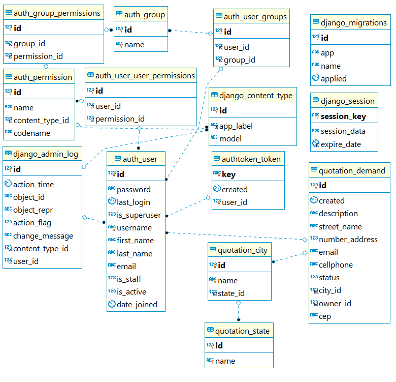

### Description
Application where contains two type of user called as Administrator or Advertiser. The adiministrator
can read all demands created by the advertisers in Django Admin (127.0.0.1:8000) and the advertiser has 
a API Rest to create, read, update and delete demands on the system. But the advertiser just can perform
CRUD operations where he created the demand.

### Some info
* When loaddata is executed the database is initialized with some states, cities and the groups of administrator (administrator) and advertiser (advertiser).
* On the folder 'collections/' contains all routes created on this application.

### Modeling

### Technologies:
* Python 3.8
* Docker
* MySQL 8.0

### Frameworks:  
Django
Django Rest Framework

### Execution:  
* docker-compose build
* docker-compose up
* docker-compose run web ./manage.py migrate
* docker-compose run web ./manage.py loaddata db.json

### Run tests:
* docker-compose run web ./manage.py test